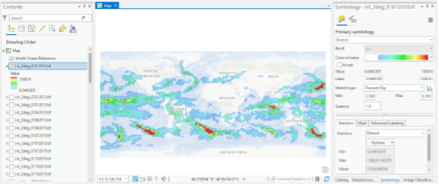
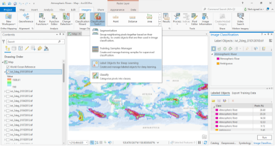
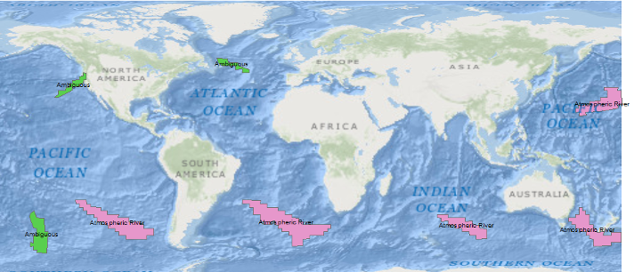
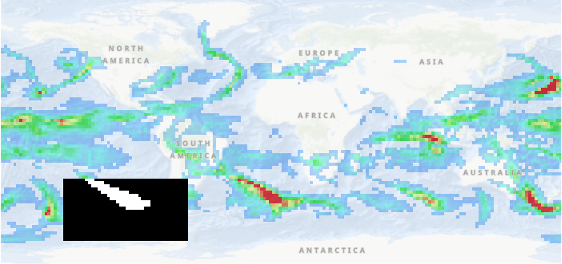

The following data has been [published](https://doi.org/10.5281/zenodo.12177339) and can be cited using: **insert citation when data is published**

## Atmospheric Rivers

Atmospheric rivers (ARs) are bodies of water vapor found in the lowest 1-3 km of the atmosphere, contributing to water vapor transport around the world. These "rivers in the sky" are responsible for many cases of extreme rainfall and floods. The frequency of ARs is likely increasing due to climate change. Understanding how atmospheric rivers have been changing and are projected to change is important to anticipate the risks to affected regions.

### Integrated Vapor Transport (IVT): A Key climate indicator for atmospheric Rivers

Integrated Vapor Transport (IVT)  is the "column-averaged horizontal transport of water vapor mass”. It is a climate variable that measures the amount of water vapor transported through the atmosphere. Atmospheric rivers are characterized by high IVT values. IVT is used by AR detection algorithms as a proxy to identify atmospheric rivers.

### Atmospheric rivers detection algorithms

AR detection algorithms typically apply thresholds for IVT values and geometric characteristics of ARs (e.g., length, length-width ratio, orientation angle).

#### How can machine learning be used to identify atmospheric rivers in IVT maps?

ARs are treated as objects with specific shapes that can be learned and detected. They are identified in IVT maps based on their shape, as an alternative to using thresholds and geometric criteria.

Computer vision is a field of machine learning designed to analyse images (maps can be considered images). It uses deep learning algorithms and offers several techniques to detect atmospheric rivers in IVT maps:

- **Object Detection:** Deep learning can be used to identify and locate atmospheric rivers within IVT maps by treating the problem as an object detection task. Algorithms such as YOLO (You Only Look Once) or Faster R-CNN (Region-Convolutional Neural Network) can be trained to detect the presence and position of atmospheric rivers.
- **Object Segmentation:** Another approach is object segmentation, where the goal is to delineate the exact boundaries of atmospheric rivers in IVT maps. Techniques like U-Net or Mask R-CNN can be applied to segment atmospheric rivers, providing detailed shape and size information.
- **Image Classification:** Deep learning can also be used to classify IVT maps to determine whether they contain an atmospheric river or not. This involves training convolutional neural networks (CNNs), such as ResNet, to analyse small sections of IVT maps and classify them based on the presence of atmospheric rivers.

These are a few examples of how deep learning can be applied to identify atmospheric rivers in IVT maps. In this [Jupyter notebook](https://github.com/coecms/CNN-Atmospheric-Rivers/blob/main/CNN_AR_tutorial.ipynb), we will focus on the image classification approach, which aims to determine if a map contains an atmospheric river. In practice, the spatial domain of interest will be divided into regions of appropriate size, and in each piece, the algorithm will detect whether or not there is an atmospheric river.

## Data Creation

The purpose of this section is not to provide step-by-step instructions for using ArcGIS to generate the data. Instead, we aim to describe the data and to give a high-level overview of how it is created. If users wish to create a similar training dataset using ArcGIS, they are encouraged to watch a YouTube tutorial that matches their proficiency level in ArcGIS.

The data is organised in three folders:
1. **IVT_ERA5_2Deg:** Contains global IVT data.
2. **AR_Global:** Contains polygons representing AR objects identified and hand-labelled in each IVT map.
3. **Training_Testing_tiles:** Contains tiles of IVT data with an annotation file that classifies each tile as one of the following: ‘Atmospheric River’, ‘Ambiguous’. The ‘Ambiguous’ class refers to objects that are not clearly identifiable as atmospheric rivers.

### 1. Importing Integrated Vapor Transport (IVT) maps into ArcGIS

For this task, we've already prepared the global IVT maps. These maps were computed using the zonal wind, meridional wind, and specific humidity variables from ERA5, following the methodology outlined by Reid et al. (2021). The IVT values are expressed in units of $kg$ $m^{-1}$ $s^{-1}$. You can find the IVT data stored in the folder **IVT_ERA5_2Deg**.

**Data description:**

- Folder: IVT_ERA5_2Deg
- File format: TIFF
- Spatial resolution: 2 degrees
- Spatial coverage: Global (longitude: -180 to 180 , latitude: -90 to  90)
- Geographic Coordinate System: GCS_WGS_1984
- Temporal coverage: 1st – 5th day of January, April, July, October for 2010, 2013, 2015; these years correspond to La Niña, neutral, and El Niño year respectively
- Temporal resolution: Daily
- Naming of files: ivt_2deg_ddmmyyyy.tif
- Number of files: 60 (5 days × 4 months × 3 years)
- Number of channels in each file: 1

All the IVT TIFF files were loaded into ArcGIS software and displayed using a colour scheme that allows for the visual identification of atmospheric rivers, as shown in Figure 1.

**Figure 1:** Tif files imported into the ArcGIS Pro workspace. A modified colour scheme replacing purple with white in the preexisting ‘Bathymetric Scale’ is used for clarity in identifying ARs.

### 2. Annotating Atmospheric Rivers in IVT maps 

The annotation tool ‘Label Objects for Deep Learning’ was used to draw polygons to cover the shape of atmospheric rivers on each IVT map as shown in Figures 2 and 3. An expert in atmospheric rivers helped with this process. Each polygon was assigned one of two labels: 'Atmospheric Rivers' or 'Ambiguous'. The polygons were drawn based on visual identification of the shape of atmospheric rivers, guided by IVT values close to $500$ $kg$ $m^{-1}$ $s^{-1}$. The 'Ambiguous' label was assigned to objects that were unclear in their classification as ARs. This ambiguity arose from objects that were shorter, wider (as shown in Figure 3), had slightly lower IVT values, or it was hard to tell if they were ARs of tropical cyclones during the early stages of their formation. 

The polygon files for the annotated ‘Atmospheric River’ and ‘Ambiguous’ objects are saved in daily files in folder **AR_Global**.

**Data description:**

- Folder: AR_Global
- File format: SHP (shapefile)
- Spatial coverage: Global
- Geographic Coordinate System: GCS_WGS_1984
- Temporal coverage: 1st – 5th day of January, April, July, October for 2010, 2013, 2015; these years correspond to La Niña, neutral, and El Niño year respectively
- Temporal resolution: Daily
- Naming of files: ivt_2deg_ddmmyyyy_labelled.shp
- Number of files: 60 (5 days × 4 months × 3 years)

**Figure 2:** Annotation tool in ArcGIS Pro and IVT map for Jan 1, 2010. ARs were identified based on their shape and IVT values ~ $500$ $kg$ $m^{-1}$ $s^{-1}$. A polygon shapefile was drawn to define the boundaries of each identified object and labelled using the ‘Label Objects for Deep Learning’ tool as ‘Atmospheric River’ or ‘Ambiguous’. 

**Figure 3:** Polygon shapefiles representing the ‘Atmospheric River’ and ‘Ambiguous’ objects identified for the Jan 1, 2010. These polygons are saved in the shapefile ivt_2deg_01012010_labelled.shp in folder **AR_Global**.

### 3. Generating a dataset for deep learning training

The tool 'Export Training Data for Deep Learning' uses the IVT maps in the 'AR_Global' folder and the shapefiles in the 'IVT_ERA5_2Deg' folder to create labelled tiles for deep learning training. All tiles are identical in dimensions, with a width of 40 pixels and a height of 20 pixels. This size is appropriate for capturing the ARs (Figure 4). Horizontal and vertical strides of 20 and 10 pixels, respectively, were applied to ensure that if an AR is cut in one tile, it would appear complete in the next. Each map generated a total of 28 tiles (TIFF files) for each global IVT map. Each tile is assigned a label: 'Atmospheric River', 'Ambiguous', or no label if it doesn’t contain any AR or ambiguous shape. The generated map chips are stored in folder **Training_Testing_tiles/ RCNN_Masks_All_Tiles (no 3-10-15)/images**, and the labels are provided in the textfile 'map.txt' file in folder **Training_Testing_tiles/ RCNN_Masks_All_Tiles (no 3-10-15)/**.

**Figure 4**: Tile sizes in relation to the size of the global map.

**Data description:**

- Folder: Training_Testing_tiles/ RCNN_Masks_All_Tiles (no 3-10-15)/images
- File format: TIFF
- Spatial resolution: 2 degrees
- Spatial coverage: varies. Width of tile = 40 gridcells. Height of tile = 20grid cells
- Geographic Coordinate System: GCS_WGS_1984
- Temporal coverage: 1st – 5th day of January, April, July, October for 2010, 2013, 2015. These years correspond to La Niña, neutral, and El Niño year respectively. Please note that data for certain days are missing; these omissions correspond to days with no or only a single 
- Temporal resolution: Daily
- Number of files: varies
- Number of channels in each file: 1

In the [Jupyter notebook](https://github.com/coecms/CNN-Atmospheric-Rivers/blob/main/CNN_AR_tutorial.ipynb), we'll show you how to use this data to train a deep learning model to identify atmospheric rivers in Integrated Vapor Transport maps.

#### References

CLEX Briefing note: Atmospheric Rivers in Australia, Kim Reid, 2022 [https://climateextremes.org.au/atmospheric-rivers-in-australia/](https://climateextremes.org.au/atmospheric-rivers-in-australia/)

Reid, K. J., King, A. D., Lane, T. P., & Short, E. (2020). The sensitivity of atmospheric river identification to integrated water vapor transport threshold, resolution, and regridding method. Journal of Geophysical Research: Atmospheres, 125(20), e2020JD032897.

Reid, K. J., O'Brien, T. A., King, A. D., & Lane, T. P. (2021). Extreme water vapor transport during the March 2021 Sydney floods in the context of climate projections. Geophysical Research Letters, 48(22), e2021GL095335.